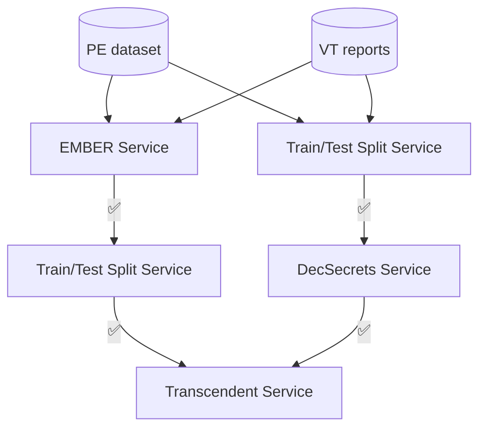

# Bootstrap

The bootstrap of the project.
This repository allows the user to *run* the Concept Drift Detection Pipeline.

The pipeline involves the following steps:

1. **Feature extraction** ([EMBER Service](https://github.com/Malware-Concept-Drift-Detection/ember-features-extraction) or [Decoding-the-Secrets Service](https://github.com/Malware-Concept-Drift-Detection/dts-features-extraction));
2. **Train/Test split** ([Train/Test Split Service](https://github.com/Malware-Concept-Drift-Detection/train-test-splits));
3. **Concept drift detection using Conformal Evaluation** ([Transcendent Multiclass Service](https://github.com/Malware-Concept-Drift-Detection/train-test-splits)).

In the following figure, an overview of the workflow:

Note that for *Decoding-the-Secrets* features, the train/test dataset split should be performed before the extraction phase, as it applies feature selection step based on IG using the training dataset.

## Prerequisites
- Make sure you have a running and active version of [Docker](https://docs.docker.com/engine/install/).

## Usage
1. Clone the repository and change directory:

    ```bash
    git clone git@github.com:Malware-Concept-Drift-Detection/bootstrap.git && cd bootstrap
    ```
2. *Run* the pipeline using the scripts provided in this repository.
   For example:
   ```bash
   bash norton670_dts_time_based.sh
   ```
    This script extracts *Decoding-the-Secrets* features from the *Norton670* dataset and applies *Transcendent*-based Concept drift detection using a *time-based* train/test split.