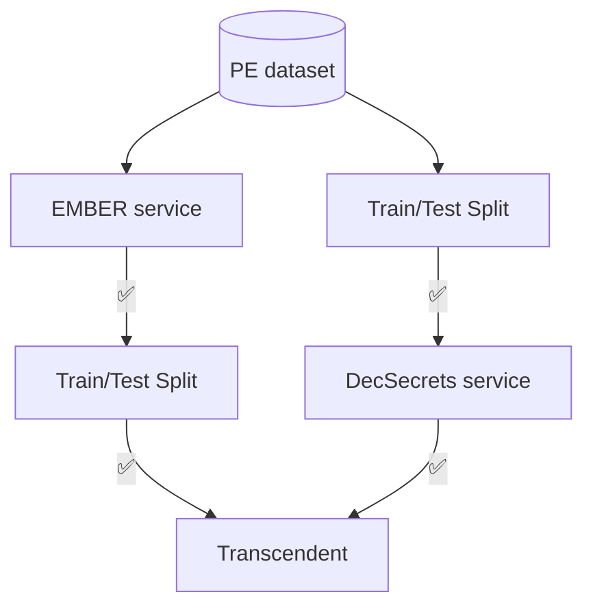

# Bootstrap

The bootstrap of the project.
This repository allows the user to *run* the Concept Drift Detection Pipeline.

The pipeline involves the following steps:

1. **Feature extraction** ([EMBER Service](https://github.com/Malware-Concept-Drift-Detection/ember-features-extraction) or [Decoding-the-Secrets Service](https://github.com/Malware-Concept-Drift-Detection/dts-features-extraction);
2. **Train/Test split** ([Train/Test Split Service](https://github.com/Malware-Concept-Drift-Detection/train-test-splits));
3. **Concept drift detection using Conformal Evaluation** ([Transcendent Multiclass Service](https://github.com/Malware-Concept-Drift-Detection/train-test-splits)).

In the following figure, an overview of the workflow:

Note that for *Decoding-the-Secrets* features, the train/test dataset split should be performed before the extraction phase, as it applies feature selection step based on IG using the training dataset.

## Prerequisites
- Make sure you have a running and active version of [Docker](https://docs.docker.com/engine/install/).

## Usage
1. Clone the repository and change directory:

    ```bash
    git clone git@github.com:Malware-Concept-Drift-Detection/bootstrap.git && cd bootstrap
    ```
2. Configure the train/test split.
   
    By default, two train/test splits are performed, specifically suited for **Norton670** dataset, a random and a time-based train/test split.
    If you have a different set of PE files, implement your own train/test splits:
     1. Write a script inside `split_scripts/`;
     2. Follow the instructions given in the [transcendent-multiclass](https://github.com/Malware-Concept-Drift-Detection/transcendent-multiclass) project to adhere to the output files and directory structure;
     3. Change the Dockerfile command, selecting the newly created script.

4. Configure `run_pipeline.sh`.
   
   Edit the variables if you want to change the base input and output directories.
   `run_pipeline.sh` default operation is:
   1. Extracting EMBER features;
   2. Performing a random and time-based train/test split, based on the code in this repository;
   3. Running Concept drift detection using the time-based split only.
5. *Run* the pipeline:
   
   ```bash
   bash run_pipeline.sh
   ```
